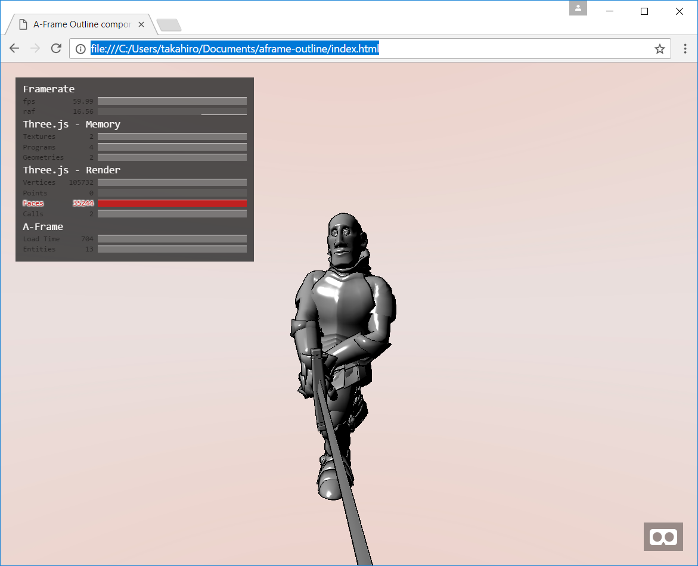

# A-Frame Outline component

aframe-outline is two-pass Outline effect component for A-Frame.



## Properties

### aframe-outline

| Properties  | type   | Default Value | Description |
| ----------- | ------ | ------------- | ----------- |
| thickness   | number | 0.003         | Outline thickness. |
| color       | color  | '#000'        | Outline color. |
| alpha       | number | 1.0           | Outline alpha. |

## Browser

### How to use

```html
<head>
  <script src="https://cdn.rawgit.com/aframevr/aframe/v0.4.0/dist/aframe-master.min.js"></script>
  <script src="https://rawgit.com/takahirox/aframe-outline/master/build/aframe-outline.min.js"></script>
</head>

<body>
  <a-scene outline>
    <a-entity position="0 10 20">
      <a-camera></a-camera>
    </a-entity>

    <a-entity geometry="primitive:sphere"></a-entity>

    <a-entity light="type:directional;color:#888" position="-10 -10 -10"></a-entity>
  </a-scene>
</body>
```

## NPM

### How to install

```
$ npm install aframe-outline
```

### How to build

```
$ npm install
$ npm run all
```

### How to load

```
require('aframe');
require('aframe-outline');
```
